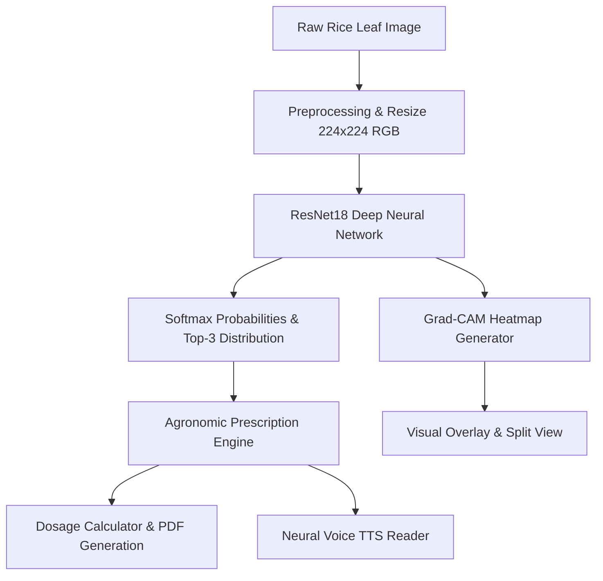

# 🌾 RiceGuard AI — Rice Leaf Disease Detection Using GAN-Augmented CNN

[](https://opensource.org/licenses/MIT)
[](https://www.python.org/)
[](https://pytorch.org/)
[](https://rice-leaf-disease-detection-1-1m1k.onrender.com/)
[](https://rice-leaf-disease-detection-1-1m1k.onrender.com/)

An AI-powered crop intelligence and computer vision platform engineered to diagnose rice leaf diseases from imagery and generate actionable agronomic prescriptions in real time. Built with **PyTorch**, **ResNet18**, **Generative Adversarial Networks (DCGAN)** for synthetic data augmentation, **Grad-CAM** for explainable AI visual attribution, and an interactive **Progressive Web App (PWA)** interface with bilingual (Bengali & English) voice assistance.

---

## 🌐 Live Web Application & Demo

Experience the live deployed platform on Render Cloud:
👉 **[https://rice-leaf-disease-detection-1-1m1k.onrender.com/](https://rice-leaf-disease-detection-1-1m1k.onrender.com/)**

---

## 🌟 Key Features

- **🌿 8-Class Botanical Classification**: Accurate diagnosis of 8 distinct rice conditions (Bacterial Leaf Blight, Brown Spot, Healthy Leaf, Leaf Blast, Leaf Scald, Narrow Brown Leaf Spot, Rice Hispa, Sheath Blight).
- **🎨 GAN Data Augmentation**: Deep Convolutional GAN (DCGAN) synthesizes photorealistic diseased leaf patches to balance training distributions and mitigate class imbalance.
- **👁️ Grad-CAM Visual Explainability (XAI)**: Generates heatmaps highlighting pathogenic lesion zones that guided the neural network's inference.
- **💊 Agronomic Treatment & Dosage Calculator**: Instant chemical, cultural, and biological recommendations with an area-based spray volume calculator (Decimal, Katha, Bigha, Acre).
- **🎙️ Neural Voice Reader**: Natural Bengali (`bn-BD`) and English (`en-US`) text-to-speech audio prescriptions for field accessibility.
- **📄 Digital Prescription PDF & WhatsApp Share**: One-click printable medical-grade crop prescription and WhatsApp direct sharing.
- **📱 Progressive Web App (PWA)**: Installable on Android, iOS, Windows, and macOS with offline-ready service worker caching.
- **🔬 Interactive Disease Encyclopedia**: Comprehensive modal database detailing pathogens, symptoms, causes, and instant sample test triggers.
- **🧪 Ground-Truth Evaluation Mode**: Built-in verification banner for researchers and evaluators to test model predictions against known labels.

---

## 🧠 Supported Rice Conditions

| # | Class Name | Pathogen / Description | Default Severity |
|---|---|---|---|
| 1 | **Bacterial Leaf Blight** | *Xanthomonas oryzae* | 🔴 Severe |
| 2 | **Brown Spot** | *Bipolaris oryzae* | 🟠 Moderate |
| 3 | **Healthy Rice Leaf** | Optimal Botanical Health | 🟢 Healthy |
| 4 | **Leaf Blast** | *Pyricularia oryzae* | 🔴 Critical |
| 5 | **Leaf Scald** | *Microdochium oryzae* | 🟠 Moderate |
| 6 | **Narrow Brown Leaf Spot** | *Cercospora janseana* | 🟠 Moderate |
| 7 | **Rice Hispa** | *Dicladispa armigera* | 🔴 Severe |
| 8 | **Sheath Blight** | *Rhizoctonia solani* | 🔴 Severe |

---

## 🏗️ System Architecture



---

## 🚀 Quickstart & Local Setup

### 1. Clone the Repository
```bash
git clone https://github.com/ekraislam/rice-leaf-disease-detection.git
cd rice-leaf-disease-detection
```

### 2. Create and Activate a Virtual Environment
```bash
# Windows
python -m venv venv
venv\Scripts\activate

# Linux / macOS
python3 -m venv venv
source venv/bin/activate
```

### 3. Install Dependencies
```bash
pip install -r requirements.txt
```

### 4. Run the Flask Web Application
```bash
python app.py
```
Open your browser and navigate to `http://127.0.0.1:5000/`.

---

## 📜 License

This project is licensed under the **MIT License** — see the [LICENSE](LICENSE) file for details.

```text
MIT License
Copyright (c) 2026 Ekra Islam Ohi
```

---

## 📖 Citation

If you find this codebase or research useful for your academic work or projects, please cite it as:

```bibtex
@software{Islam_RiceGuard_AI_2026,
  author = {Ekra Islam Ohi},
  title = {{Rice Leaf Disease Detection Using GAN-Augmented CNN (RiceGuard AI)}},
  year = {2026},
  url = {https://github.com/ekraislam/rice-leaf-disease-detection},
  publisher = {GitHub}
}
```

---

## 👨‍💻 Author & Developer

**Ekra Islam Ohi**  
- **GitHub**: [@ekraislam](https://github.com/ekraislam)
- **Repository**: [https://github.com/ekraislam/rice-leaf-disease-detection](https://github.com/ekraislam/rice-leaf-disease-detection)
- **Live Platform**: [https://rice-leaf-disease-detection-1-1m1k.onrender.com/](https://rice-leaf-disease-detection-1-1m1k.onrender.com/)
